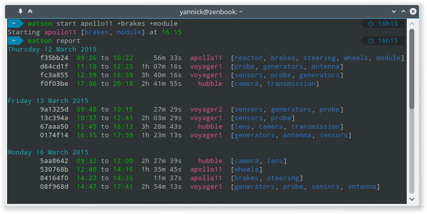

# Watson

A wonderful CLI to track your time!

## Overview

Watson is here to help you monitoring your time. You want to know how
much time you are spending on your projects? You want to generate a nice
report for your client? Watson is here for you.

Tell Watson when you start working on a task with the `start` command.
Then, when you are done with this task, stop the timer with the `stop`
command. This will create what we call a **frame**. That's pretty much
everything you need to know to start using Watson.

Each frame consists of the name of a project and some tags. Your tags
can be shared across projects and can be used to generate detailed
reports.

Watson stores everything on your computer, but you can go wild and use
[artich.io](https://artich.io/?pk_campaign=GitHubWatson) to store
your sessions remotely and share it with your colleagues.



## Installation

Watson is available on any platform supported by Python (Windows, Mac,
Linux, *BSD…). The easiest way to install it is to use
[pip](https://pip.pypa.io/en/stable/installing/):

```bash
$ pip install td-watson
```

Depending on your system, you might need to run this command with root privileges in order to install Watson globally.

### Single user installation

You can choose to install Watson for your user only by running:

```bash
$ pip install --user td-watson
```

If after this the `watson` command is not available, you need to add `~/.local/bin/` to your `PATH`. If your terminal is Bash, you can do this by running:

```bash
$ echo 'export PATH="$HOME/.local/bin:$PATH"' >> ~/.bashrc  # Add ~/.local/bin/ to your .bashrc PATH
```

and restarting your terminal session or sourcing the `.bashrc`:

```bash
$ source ~/.bashrc  # Reload your .bashrc
```

### Development version

The latest development version can be installed using the following commands:

```bash
$ git clone https://github.com/TailorDev/Watson.git
$ cd Watson/
$ python setup.py install
```

### Command line completion

If you use a Bash-compatible shell, you can install the `watson.completion` file from the source distribution as `/etc/bash.completion.d/watson` - or wherever your distribution keeps the Bash completion configuration files. After you restart your shell, you can then just type `watson` on your command line and then hit `TAB` to see all available commands. Depending on your input, it completes `watson` commands, command options, projects, tags and frame IDs.

## Getting started

Now that `watson` is installed on your system, let's start tracking your activity:

```bash
$ watson start world-domination +cats
```

With this command, you have started a new **frame** for the *world-domination* project with the *cat* tag. Time is running. Now, you need to work on your project. Let's do this. Now.


Welcome back! Now that your world domination plan has been set up, let's stop time tracking via:

```bash
$ watson stop
Project world-domination [cat] started 34 minutes ago (id: 166d1fb)
```

To list all available commands, either [explore the commands documentation](user-guide/commands.md) or use:

```bash
$ watson help
```

We hope you will enjoy Watson!
